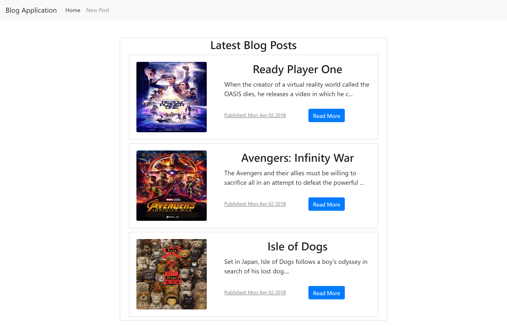
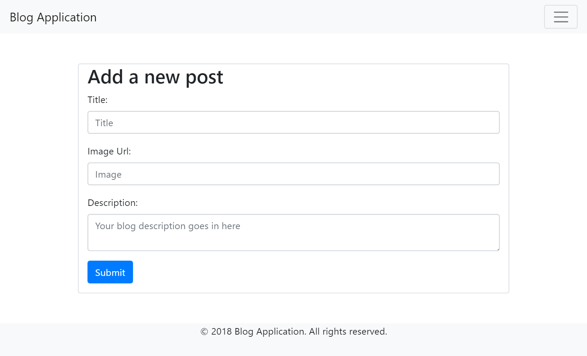
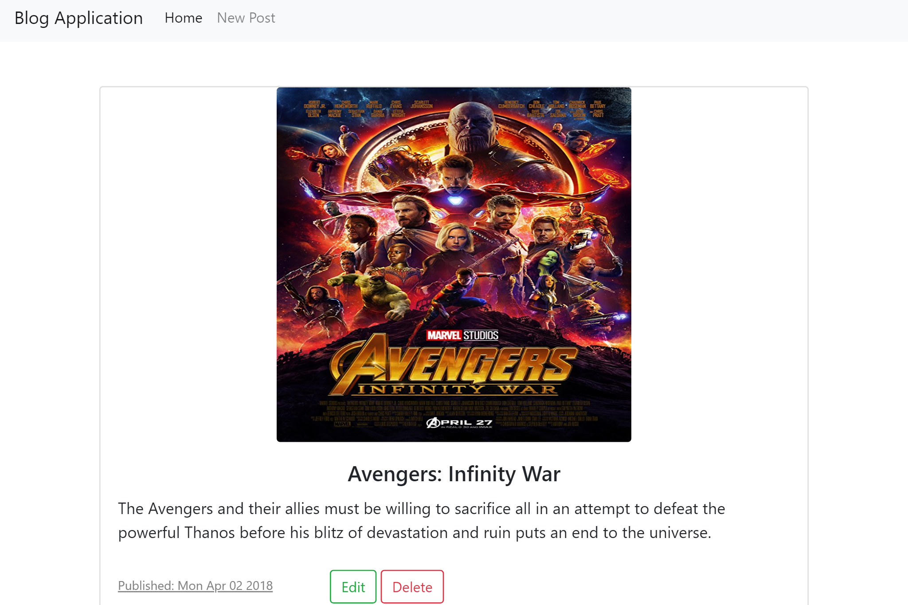

# BlogApp_Express
<strong>Description:</strong>A RESTful Blog Application that uses a minimal and flexible Node.js web application framework that provides a robust set of features for web and mobile applications called Express. The application uses a NoSQL database MongoDB and is designed with the framework Bootstrap 4.

<strong>Screenshot One:</strong>

  

<strong>Screenshot Two:</strong>

  

<strong>Screenshot Three:</strong>

  

